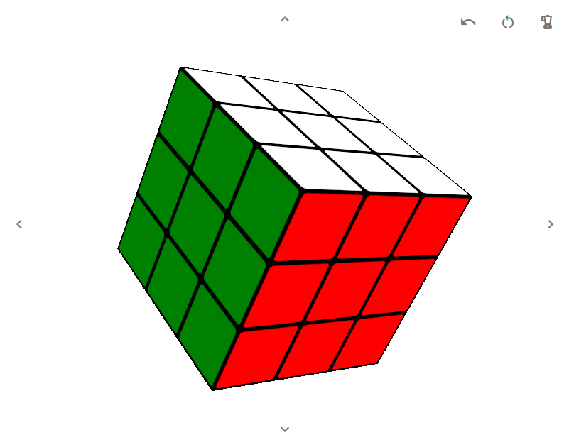

# React CSS Rubik's Cube

This codebase showcases a Rubik's cube rendered in CSS, no modeling libraries used.\
Simply applying a rotation class to the `rubiks` element can apply a move to the cube visually.\
React is used to save the cube state after a rotation takes place as well as for helper functions like resetting the cube, scrambling the cube, and undoing moves.\
The cube pieces themselves only re-render to apply a new color.
## Usage

### Making moves
- Left-click on a side to rotate the side clockwise
- Right-click on a side to rotate the side counter-clockwise
- Hover over an edge of a side to reveal arrows for rotating slices of the cube as opposed to a side

### Additional Functionality
- The blender icon scrambles the cube
- The revert icon resets the cube
- The undo icon will undo the last move

### Cube Sizing
In local development, you can adjust the cube size to be a 2x2, 3x3, or whatever size desired by both:
- Setting the `cubeWidth` in [src/RubiksController/config.js](src/RubiksController/config.js)
- Setting the `cubeWidth` in [src/styles/variables.scss](src/styles/variables.scss)

Once done, reloading the page will render a working cube to the appropriate size

## Local Development
### `npm start`

Runs the app in the development mode.\
Open [http://localhost:3000](http://localhost:3000) to view it in the browser.

### `npm run build`

Builds the app for production to the `build` folder.